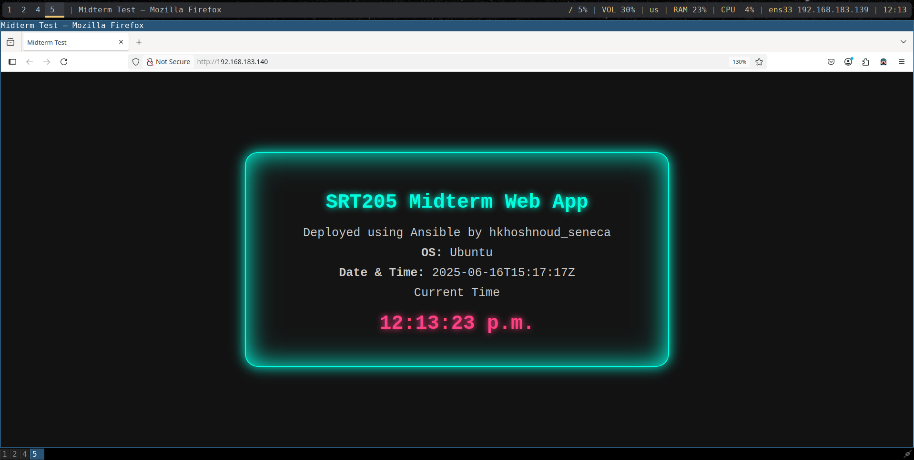

### Deliverable 1: the output of ansible
**Input**:
```bash
# Command executed
ansible-playbook -i inventory/hosts playbooks/webserver_setup.yml
```
**Output**:
```bash
PLAY [Configure Web Server on MidtermNode01] **************************************************************************************************************************************************

TASK [Gathering Facts] ************************************************************************************************************************************************************************
ok: [MidtermnNode01]

TASK [Install Nginx] **************************************************************************************************************************************************************************
ok: [MidtermnNode01]

TASK [Start and enable Nginx service] *********************************************************************************************************************************************************
ok: [MidtermnNode01]

TASK [Create web root directory] **************************************************************************************************************************************************************
ok: [MidtermnNode01]

TASK [Copy web files to web root] *************************************************************************************************************************************************************
changed: [MidtermnNode01] => (item=index.html)
ok: [MidtermnNode01] => (item=script.js)
ok: [MidtermnNode01] => (item=styles.css)

TASK [Check if index.html exists in web_root] *************************************************************************************************************************************************
ok: [MidtermnNode01]

TASK [Replace placeholders in index.html] *****************************************************************************************************************************************************
changed: [MidtermnNode01] => (item={'regex': 'OS_PLACEHOLDER', 'replace': 'Ubuntu'})
changed: [MidtermnNode01] => (item={'regex': 'DATETIME_PLACEHOLDER', 'replace': '2025-06-16T16:14:37Z'})
changed: [MidtermnNode01] => (item={'regex': 'NAME_PLACEHOLDER', 'replace': 'hkhoshnoud_seneca'})

RUNNING HANDLER [Restart Nginx] ***************************************************************************************************************************************************************
changed: [MidtermnNode01]

PLAY RECAP ************************************************************************************************************************************************************************************
MidtermnNode01             : ok=8    changed=3    unreachable=0    failed=0    skipped=0    rescued=0    ignored=0
```
## Screenshots Deliverables
### Deliverable 2: my webserver deployment
 